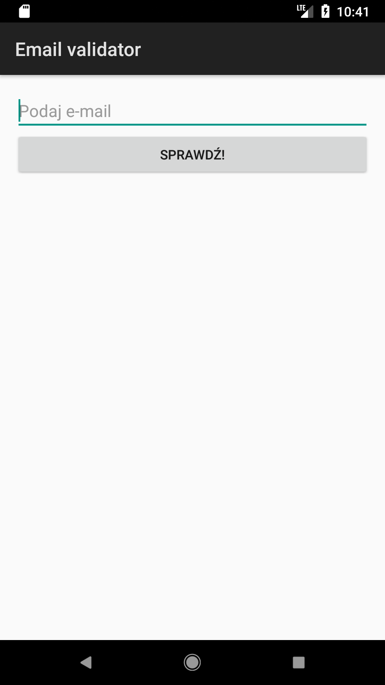
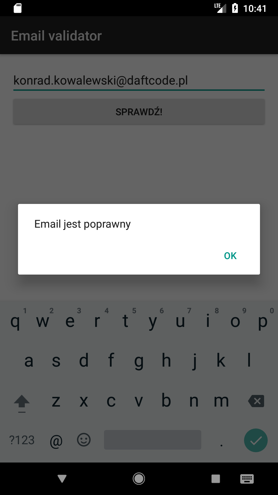
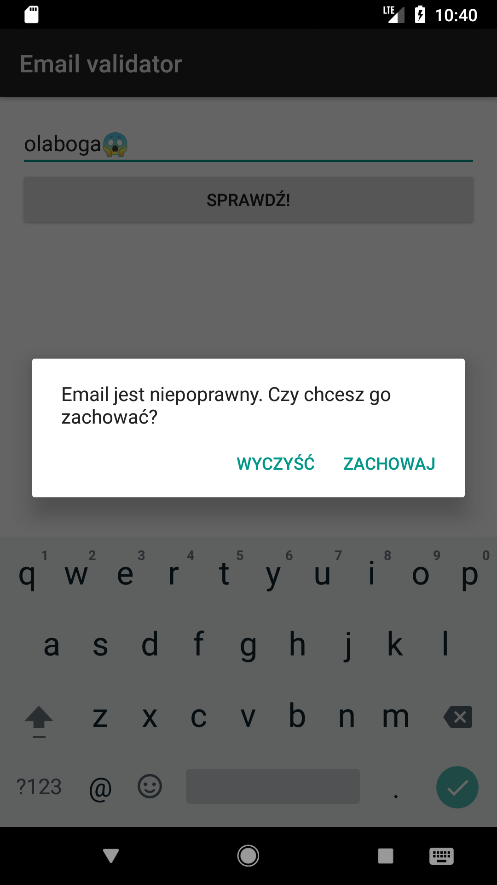

## Zadanie
Zadanie polega na przygotowaniu aplikacji, która umożliwi użytkownikowi wpisanie adresu email i sprawdzenie, czy jest poprawny.
Ekran aplikacji powinien składać się z pola tekstowego `EditText` oraz przycisku `Button` z napisem **Sprawdź**.
Kliknięcie przycisku powinno wywołać dialog zależny od rezultatu sprawdzenia:
1. Jeśli email jest poprawny, należy pokazać dialog z napisem *"Email jest poprawny"* oraz przyciskiem **OK**.
2. Jeśli email nie jest poprawny, to należy pokazać dialog o treści *"Email jest niepoprawny. Czy chcesz go zachować?"* z przyciskami **Zachowaj** oraz **Wyczyść**.
Kliknięcie przycisku **Wyczyść** powinno wyczyścić zawartość pola tekstowego z adresem email.

Obydwa dialogi powinny się zamykać wraz z kliknięciem dowolnego przycisku.

Tak powinna wyglądać gotowa apka:

## Wskazówki
Pobierzcie projekt znajdujący się w folderze A4BHomework1, a następnie:

1. Najpierw przeciągnijcie do widoku `activity_main.xml` odpowiednie widoki za pomocą Layout Editora.
2. Aby uzyskać referencje do obiektów dodanych widoków, pamiętajcie, by każdemu nadać atrybut `android:id="+id/tutajWaszeId"` (w XMLu lub Layout Editorze) a następnie odwołać się do pola o nazwie `tutajWaszeId` dostępnego w `MainActivity`. Zacznijcie wpisywać id, a IDE samo podpowie resztę i zaimportuje odpowiednią klasę.
3. Do skonstruowania dialogu wykorzystajcie klasę `AlertDialog.Builder` zainicjowaną z waszym `Activity` jako parametrem.
4. Do dodania przycisków przydadzą się metody `setPositiveButton()` oraz `setNegativeButton()` obiektu `AlertDialog.Builder`. Każda z nich przyjmuje jako parametry napis (np. **Zachowaj**) oraz listener wywoływany po naciśnięciu danego przycisku. Jako listenery najłatwiej będzie użyć wyrażeń lambda.
5. Pamiętajcie, by `OnClickListener` przycisku **Sprawdź** ustawiać w metodzie `onCreate()` w `MainActivity`.
6. Do sprawdzenia poprawności adresu e-mail wykorzystajcie klasę `EmailValidator`, którą umieściłem w projekcie.

## Kryteria oceny
1. Aplikacją się kompiluje i uruchamia
2. Wszystkie elementy są obecne
3. Wszystkie zdarzenia działają poprawnie

## Termin
Spakowany folder .zip z projektem należy wysłać do wtorku 03.04.2018 do godziny 15:00 na adres [email](mailto:konrad.kowalewski+homework1@daftcode.pl).

