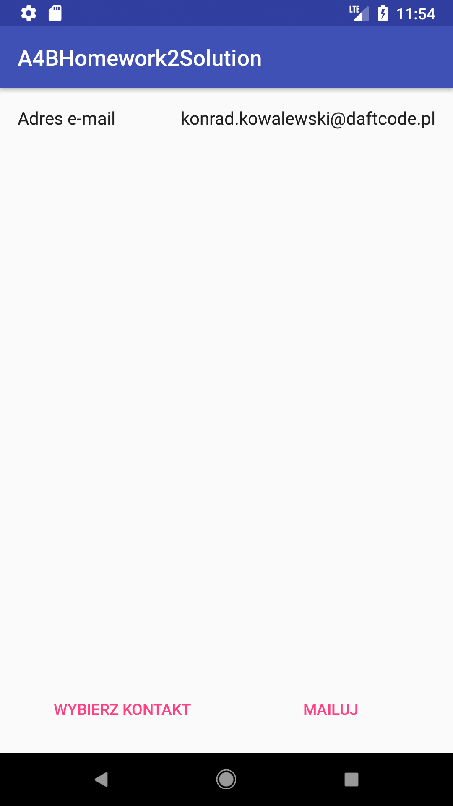

## Zadanie
Zadanie polega na przygotowaniu aplikacji, w której użytkownik będzie mógł wybrać jeden z dostępnych w telefonie kontaktów i wysłać e-maila na adres z tego kontaktu.
Ekran aplikacji powinien składać się z dwóch `TextView` oraz dwóch przycisków `Button` jak na screenshocie poniżej:

Kliknięcie przycisku **WYBIERZ KONTAKT** powinno wywołać systemowy ekran wyboru kontaktu. Informację, jak to zrobić, znajdziecie we wskazówkach.
Wybrany email powinien wyświetlić się w polu tekstowym w prawym górnym rogu.
Następnie, kliknięcie przycisku **MAILUJ** powinno otworzyć aplikację mailową, pozwalając wysłać maila na wybrany wcześniej adres o temacie *"Wiadomość z pracy domowej"*. Zajrzyjcie do wskazówek po więcej informacji.

## Wskazówki
Pobierzcie projekt znajdujący się w folderze A4BHomework2, a następnie:

1. Stwórzcie odpowiedni *layout*. Możecie zajrzeć do projektu Android4Beginners3, aby przypomnieć sobie podstawy.
2. Aby pozwolić użytkownikowi na wybór kontaktu i otwarcie aplikacji mailowej, skorzystajcie z *implicit* `Intentów`. Tak wyglądał przykład z zajęć:
```Kotlin
// Tworzymy "intencję" otwarcia telefonu
val intent = Intent(Intent.ACTION_DIAL)
// Podajemy numer telefonu w paczce oczekiwanej przez ten typ intentu
intent.data = Uri.parse("tel:" + ourPhoneNumber)
// Prosimy system o wybór odpowiedniego activity
val componentName = intent.resolveActivity(packageManager)
if (componentName != null) {
	// Jeśli znaleziono, to otwieramy
	startActivity(intent)
}
```
3. Informację wraz z przykładem o tym, jak otworzyć wybór kontaktu by uzyskać konkretne info (w naszym przypadku adres email), znajdziecie [w tej sekcji](https://developer.android.com/guide/components/intents-common.html#Contacts) dokumentacji. Działanie jest analogiczne do przykładu z zajęć.
**HINT:** Najlepiej sprawdzi sie ten typ podany w `Intencie`: `CommonDataKinds.Email.CONTENT_TYPE`.
4. Result, który wróci z tego activity do metody `onActivityResult(...)`, będzie zawierał w property `data` `Uri` wskazujące na wybrany kontakt. Funkcję pozwalającą uzyskać adres email z tego `Uri` umieściłem w `MainActivity`.
5. Informację o intencji wysłania emaila i jak pozwolić systemowi na obsłużenie jej znajdziecie w [dalszej sekcji](https://developer.android.com/guide/components/intents-common.html#Email).
6. Zadanie dużo łatwiej będzie wykonać uruchamiając aplikację na telefonie, ponieważ na emulatorze istnieje domyślnie zero kontaktów oraz nieskonfigurowany gmail. Na emulatorze można jednak dodać kontakt, a jeśli gmail po prostu się uruchomi, to znaczy, że wszystko jest OK!

Piszcie, jeśli będziecie mieli jakieś pytania. Powodzenia!

## Termin
Spakowany folder .zip z projektem należy wysłać do końca wtorku 10.04.2018 na adres [email](mailto:konrad.kowalewski+homework2@daftcode.pl). Jeśli usuniecie z projektu folder app/build przed spakowaniem, gmail powinien wam pozwolić wysłać .zip jako załącznik.

