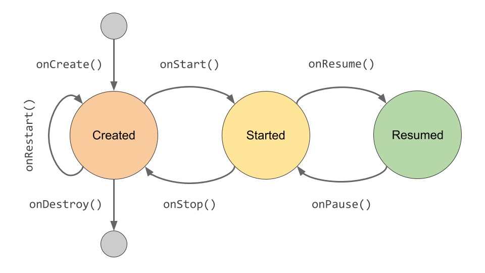

[](https://github.com/DaftMobile/android4beginners_2018)


# Zajęcia Android 4 Beginners – WEiTI, wiosna 2018

## Zajęcia

### Zajęcia 1. Hello, world! from Kotlin

Było dużo o charakterystycznych elementach składni Kotlina, ale też sporo o nowych mechanizmach (immutable collections, extension functions). W sekcji [Materiały](#Materiały) jest link do ćwiczeń z Kotlina (Kotlin Koans). Polecam, jeśli chcecie poćwiczyć przed następnymi zajęciami.

W folderze Android4Beginners1 znajdziecie kod z pierwszych zajęć wzbogacony o komentarze, które uznałem za istotne.

### Zajęcia 2. Pierwszy ekran

Opowiedzieliśmy sobie, czym jest `Activity` i na czym polega jego cykl życia. Załączam schemat z prezentacji.


Było też o tworzeniu layoutu poprzez dodawanie do niego widoków w Layout Editorze oraz o tym, jak te widoki przedstawione są w XMLu. Więcej możecie o tym poczytać [tutaj](https://developer.android.com/training/basics/firstapp/building-ui.html). Nie zabrakło informacji o tym, jak reagować na eventy związane z tapowaniem widoków. 

Na koniec wspomnieliśmy też o tym, że `Context` istnieje i nie należy się go bać, mimo że jest ogromny i wszechpotężny ;]

Jak poprzednio, w folderze Android4Beginners2 znajdziecie kod z zajęć wzbogacony o komentarze.

### Zajęcia 3. 10000 urządzeń, jeden kod

Było o dwóch popularnych layoutach: `LinearLayout` oraz `RelativeLayout`. Wyjaśniłem, jak działają, a także jak wykorzystywać `gravity`. W folderze Android4Beginners3 jest projekt, w którym tymi layoutami można się pobawić.

Następnie powiedzieliśmy sobie o *resource*'ach oraz o *resource qualifiers*, dzięki którym możemy lokalizować aplikacje lub przystosowywać je do różnych ekranów. Przykładowe zastosowanie znajdziecie w rozwiązaniu pracy domowej nr 1. Dużo więcej informacji na ten temat - gdybyście ich potrzebowali - znajdziecie w [android guide](https://developer.android.com/guide/topics/resources/index.html).

W kolejnej części zajęliśmy się `Intentami` oraz otwieraniem innych `Activity`. Pokazałem też, jak opakowywać w `Intentach` dodatkowe dane i przenosić je między różnymi `Activity`. Zakładam, że to, co stworzyliście w trakcie zajęć, wystarczy jako notatki. Gdyby jednak ktoś szukał pomocy, polecam [ten](https://developer.android.com/training/basics/firstapp/starting-activity.html#kotlin) fragment przewodnika.

Na koniec wspomnieliśmy o tym, że korzystamy z *supportu*, by minimalizować wpływ fragmentacji na nasze życie (przynajmniej w aspekcie programowania na Androida).

Przypominam, że w razie niepewności bądź pytań związanych z materiałem z zajęć można pisać na adres znajdujący się na końcu readme :)

### Zajęcia 4. A little architecture

Mówiliśmy o tym, że należy `Activity` traktować jako prosty obiekt, za pomocą którego użytkownik komunikuje się z naszą aplikacją. W związku z powyższym, powinniśmy nasze `Activities` w miarę możliwości odciążać z zadań niezwiązanych z wyświetlaniem treści i obsługą zdarzeń.

Pokazaliśmy sobie, jak do tego celu wykorzystać wzorzec [MVVM](https://en.wikipedia.org/wiki/Model%E2%80%93view%E2%80%93viewmodel) oraz oferowaną przez Googlersów klasę [ViewModel](https://developer.android.com/topic/libraries/architecture/viewmodel.html) z pakietu  **Android Architecture Components** (link w zakładce [Materiały](#Materiały)). Androidowy `ViewModel` jest nieco podrasowany i potrafi rozpoznać, co dzieje się z naszym `Activity`, dzięki czemu nie musimy przejmować się utratą stanu i naszych danych. Było też trochę o tym, jak skonstruować prostą warstwę **modelu**, z którą może się komunikować nasz `ViewModel`.

Nauczyliśmy się także wykorzystywać [LiveData](https://developer.android.com/topic/libraries/architecture/livedata.html) do zarządzania zasobożernymi serwisami udostępnianymi przez platformę, takimi jak dane z **sensorów** czy **geolokalizacja**. Przykład znajdziecie w folderze Android4Beginners4.

Na koniec poruszyliśmy temat związany z *UI*, czyli **Options menu** znane z wielu androidowych aplikacji. Więcej na ten temat możecie przeczytać [tutaj](https://developer.android.com/guide/topics/ui/menus.html#options-menu).

### Zajęcia 5. Networking 101. O wątkach i wyjątkach

Na początku opowiedziałem o wyjątkach. Mówiliśmy, kiedy i jak je rzucać (`throw`) oraz jak je łapać (`try-catch-finally`). Porównaliśmy *checked exceptions* and *runtime exceptions* i omówiliśmy **brak** mechanizmu wymuszania przez kompilator obsługi *checked exceptions* w Kotlinie (w odróżnieniu od Javy).

Dalej powiedzieliśmy sobie, czym jest **wątek główny** (*main thread*/*UI thread*) w Androidzie oraz że nigdy **nie należy go blokować** oraz nie wolno modyfikować UI *spoza* tego wątku. Z tego tematu przeszliśmy płynnie do networkingu, ponieważ nie można łączyć się z Internetem z głównego wątku.

O networkingu powiedzieliśmy, jak wykorzystać do obsługi REST API bibliotekę [Retrofit](http://square.github.io/retrofit/). Należy stworzyć interfejs (w języku Kotlin/Java), w którym każda metoda (opatrzona odpowiednią adnotacją) będzie odpowiadała jednemu endpointowi API, a następnie utworzyć instację naszego interfejsu za pomocą obiektu `Retrofit`. Przykładowy interfejs do komunikacji z API [Switter](https://github.com/DaftMobile/switter) przedstawiam poniżej:
```kotlin
interface JokeApi {
    // ednpoint /api/hello
    @GET("/api/hello")
    fun hello(): Call<ResponseBody>

    // enpoint /api/joke with basic header auth
    @GET("/api/joke")
    fun joke(@Header("x-device-uuid") uuid: String): Call<ResponseBody>
}
``` 
Więcej na temat biblioteki możecie przeczytać w zlinkowanym readme.

Na koniec wspomnieliśmy o tym, że większość istniejących API udostępnia dane enkodowane za pomocą składni JSON. Przedstawiłem, jak serializować i deserializować Kotlinowe obiekty z/do postaci JSON za pomocą biblioteki [Gson](https://github.com/google/gson).

Więcej informacji o tym, jak najefektywniej połączyć **Gson** i **Retrofit** znajdziecie we wskazówkach do pracy domowej nr 4.

## Materiały

- [Kotlin Koans](http://kotlinlang.org/docs/tutorials/koans.html)
- [Android Developers](https://developer.android.com/index.html)
- [Android Architecture Components](https://developer.android.com/topic/libraries/architecture/index.html)

## Kontakt

- [E-mail](mailto:konrad.kowalewski@daftcode.pl)
